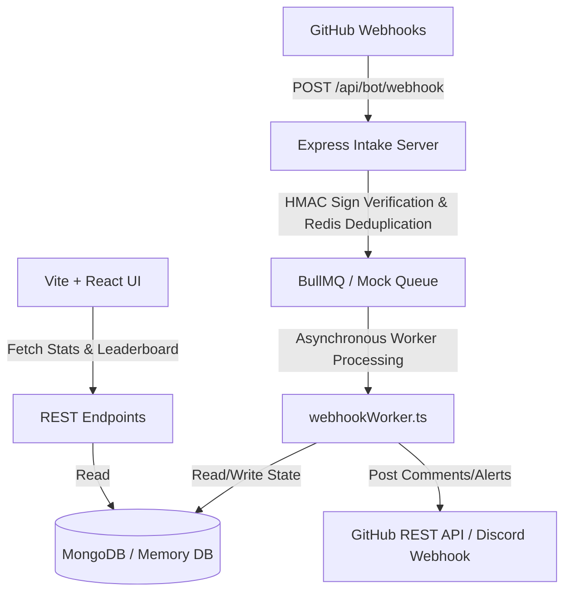

# IEEESoc Bot - Automated Contribution Tracker

An event-driven contribution tracking system, anti-cheat engine, and mentorship auditor designed for the Graphic Era Hill University IEEE Student Branch fellowship programs. The system automates pull request complexity scoring, co-authored points split, mentor SLA tracking, and renders a real-time leaderboard dashboard.

---

## Key Features

*   **Decoupled Webhook Ingest**: A lightweight Express.js intake server verifying GitHub HMAC signatures and deduplicating deliveries via Redis cache within 500ms, adhering to GitHub's 3-second SLA.
*   **Asynchronous Processing Pipeline**: Utilizes BullMQ + Redis background workers to serialize webhook processing and prevent server blocking during high-volume periods.
*   **Dual Gamification Engine**:
    *   *Fellows*: Points allocated for merged contributions based on difficulty labels (soc-easy = 10, soc-medium = 30, soc-hard = 60).
    *   *Mentors*: SLA points awarded for fast turnaround on reviews (+15 points under 24 hours, +5 points under 48 hours).
*   **Anti-Cheat Protection**: Auto-suspends points for unauthorized self-merging and fellow-triggered post-merge label tampering. Flags low-effort contributions.
*   **Sandbox Simulation Mode**: Seamless fallback to fully functional mock states (using in-memory MongoDB replica, ioredis-mock, and virtual queue processors) if external configuration credentials are absent.
*   **Control Panel UI**: Professional dark-mode React client incorporating visual leaderboards, interactive webhook simulators, real-time pipeline log monitors, and administrative resync controls.

---

## Architecture Diagram



---

## Repository Structure

```
├── .env.example              # Environment variables template
├── tsconfig.json             # TypeScript settings
├── vite.config.ts            # Vite bundler configuration
├── server.ts                 # Full-stack backend Express starter & dev middleware
├── index.html                # Vite SPA main page template
├── docs/                     # Architectural, PRD, and setup manuals
└── src/
    ├── main.tsx              # React mounting root
    ├── index.css             # Base styles
    ├── App.tsx               # Main frontend Control Panel UI
    ├── config/
    │   ├── db.ts             # MongoDB and MongoMemoryServer setup
    │   └── redis.ts          # Redis connections & BullMQ/mock queues
    ├── models/
    │   ├── User.ts           # Fellow and Mentor MongoDB Schemas
    │   ├── Repository.ts     # Vetted repository catalog
    │   └── PullRequest.ts    # PR reviews and point scoring metadata
    ├── routes/
    │   ├── admin.ts          # Repository audits & JWT authentication
    │   ├── leaderboard.ts    # Leaderboard analytics & stats aggregator
    │   └── webhook.ts        # Webhook ingest endpoints & crypto verification
    ├── utils/
    │   └── github.ts         # GitHub App Octokit integrations & Discord webhooks
    └── workers/
        └── webhookWorker.ts  # Webhook handlers, scoring, and anti-cheat checks
```

---

## Getting Started & Installation

### 1. Prerequisites
*   Node.js (v18.0.0 or higher)
*   MongoDB (Optional - falls back to mongodb-memory-server if omitted)
*   Redis (Optional - falls back to ioredis-mock thread execution if omitted)

### 2. Install Dependencies
```bash
npm install
```

### 3. Environment Setup
Create a `.env` file in the root of the project by copying the provided template:
```bash
cp .env.example .env
```
Default parameters inside the environment template:
```env
# Credentials for Admin Audit Login (JWT Token generation)
JWT_SECRET="super_secret_jwt_key_for_admin_resync"

# Optional credentials (If omitted, Sandbox Simulator runs automatically)
MONGODB_URI="mongodb://localhost:27017/ieeesoc-bot"
REDIS_URL="redis://localhost:6379"
GITHUB_WEBHOOK_SECRET="your_github_webhook_secret_here"
DISCORD_WEBHOOK_URL="https://discord.com/api/webhooks/..."
```

### 4. Running Locally
Run the combined development server (starts the Express backend alongside the Vite frontend):
```bash
npm run dev
```
Open http://localhost:3000 in your browser.

---

## Scoring & Anti-Cheat Rules

### 1. Points Allocation
*   **soc-easy (10 pts)**: Typo corrections, README changes, minor CSS styling, or simple comments.
*   **soc-medium (30 pts)**: Standard features, logical fixes, unit testing, schema migrations.
*   **soc-hard (60 pts)**: Architecture shifts, queries optimization, core security patches, smart contracts.
*   **Co-authors**: Recognized co-authors in commit messages (Co-authored-by: user <email>) receive a 50% points bonus (rounded) while the main author gets 100%.

### 2. Cheat Mitigations
*   **Author Self-Merge**: Direct merges by authors receive 0 points and are flagged as suspicious in the database.
*   **Post-Merge Labeling**: If a PR is merged unlabeled, it receives 0 points. Re-labeling post-merge updates scores only if performed by a Mentor or Admin. Fellow tampering is blocked.
*   **Low-Effort PRs**: PRs marked medium or hard with less than 5 total modified lines are flagged for human review.

---

## Testing with the Webhook Simulator

When running in Sandbox/Preview Mode on localhost:3000, the Control Panel enables complete testing of the system without setting up external webhooks:
1.  **Enroll Fellows**: Fill out the enrollment form to pre-register developer profiles.
2.  **Fire Webhooks**: Use the Webhook Simulator panel to trigger simulated event payloads (PR opened, PR merged, self-merges, post-merge labels, fast mentor review).
3.  **Monitor Pipelines**: Watch the Pipeline Monitor tabs:
    *   *Redis Queues* will show job statuses moving from pending -> processing -> completed in real-time.
    *   *Bot Outputs* will print simulated comments posted, Discord notifications dispatched, and mock API calls.
4.  **Admin Resync**: Authenticate using administrative credentials (username: admin, password: ieeesoc2026) to log in as an administrator, then select a repository to run manual historical alignment audits.