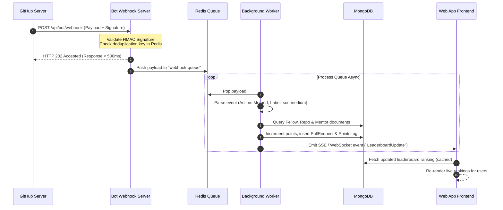

# System Architecture & Technical Design

## 1. System Architecture Overview

The IEEEsoc-Bot infrastructure follows an event-driven, decoupled microservices model. It consists of the GitHub App, a Bot Webhook Server, an asynchronous processing queue (Redis + BullMQ), a shared primary database (MongoDB), and the main IEEEsoc Web Application.

This architecture ensures that high-volume events (such as synchronized push/merge activity at the end of sprints) do not block or crash the system, and that all webhook deliveries are processed within GitHub's strict **3-second timeout SLA**.

### High-Level Components
1. **GitHub App Webhook Engine**: Emits real-time event payloads for pull requests, reviews, and labels.
2. **Bot Webhook Intake Server (Express.js)**: A lightweight Node.js API that receives webhooks, cryptographically validates signatures, performs rapid event filtering, and pushes payloads to a Redis queue before immediately returning an HTTP 202 (Accepted) response to GitHub.
3. **Queue & Worker Service (Redis + BullMQ)**: Buffers incoming events and processes them sequentially via workers to update stats and handle rate-limiting.
4. **Database (MongoDB/Mongoose)**: The shared data store representing the state of all Fellows, Mentors, Repositories, and Pull Requests.
5. **Main Web App API & Front-end**: Interacts with the shared database to present the public national leaderboard, user profiles, and the administrative project crate marketplace.

---

## 2. Event & Data Flow

Below is the step-by-step lifecycle of a pull request event, tracing it from GitHub to the live leaderboard:



---

## 3. Database Entity Schemas (Mongoose)

We utilize MongoDB with Mongoose ODM for rapid prototyping and flexibility across varying project structures. Below are the production schemas required for the bot tracking engine:

### 3.1 User Schema (`models/User.js`)
Stores metadata and points statistics for both Fellows and Mentors.

```javascript
const mongoose = require('mongoose');

const UserSchema = new mongoose.Schema({
  githubId: { type: String, required: true, unique: true, index: true },
  username: { type: String, required: true, unique: true },
  name: { type: String, required: true },
  email: { type: String, required: true },
  avatarUrl: { type: String },
  role: { 
    type: String, 
    enum: ['fellow', 'mentor', 'admin', 'viewer'], 
    default: 'fellow' 
  },
  track: { 
    type: String, 
    enum: ['AI', 'Full-Stack', 'DevOps', 'Security', 'Frontier'], 
    required: function() { return this.role === 'fellow'; } 
  },
  assignedRepo: { type: mongoose.Schema.Types.ObjectId, ref: 'Repository' },
  score: { type: Number, default: 0, index: true }, // Incremented by bot
  mentorScore: { type: Number, default: 0 }, // For Mentorship Excellence Leaderboard
  isActive: { type: Boolean, default: true },
  linkedinUrl: { type: String },
  joinedAt: { type: Date, default: Date.now }
});

module.exports = mongoose.model('User', UserSchema);
```

### 3.2 Repository Schema (`models/Repository.js`)
Represents the vetted project repository listed on the Project Crate marketplace.

```javascript
const mongoose = require('mongoose');

const RepositorySchema = new mongoose.Schema({
  repoId: { type: String, required: true, unique: true, index: true },
  name: { type: String, required: true },
  fullName: { type: String, required: true }, // e.g., "org/repo"
  owner: { type: String, required: true },
  htmlUrl: { type: String, required: true },
  track: { 
    type: String, 
    enum: ['AI', 'Full-Stack', 'DevOps', 'Security', 'Frontier'], 
    required: true 
  },
  mentors: [{ type: mongoose.Schema.Types.ObjectId, ref: 'User' }],
  fellows: [{ type: mongoose.Schema.Types.ObjectId, ref: 'User' }],
  installationId: { type: String, required: true }, // GitHub App Installation ID
  isActive: { type: Boolean, default: true }
});

module.exports = mongoose.model('Repository', RepositorySchema);
```

### 3.3 PullRequest Schema (`models/PullRequest.js`)
Tracks the history and metadata of every pull request submitted by Fellows.

```javascript
const mongoose = require('mongoose');

const PullRequestSchema = new mongoose.Schema({
  prId: { type: String, required: true, unique: true, index: true },
  prNumber: { type: Number, required: true },
  repository: { type: mongoose.Schema.Types.ObjectId, ref: 'Repository', required: true },
  author: { type: mongoose.Schema.Types.ObjectId, ref: 'User', required: true },
  title: { type: String, required: true },
  htmlUrl: { type: String, required: true },
  state: { type: String, enum: ['open', 'closed', 'merged'], default: 'open' },
  isDraft: { type: Boolean, default: false },
  difficultyLabel: { 
    type: String, 
    enum: ['soc-easy', 'soc-medium', 'soc-hard', 'unlabeled'], 
    default: 'unlabeled' 
  },
  pointsAwarded: { type: Number, default: 0 },
  createdAt: { type: Date, required: true },
  closedAt: { type: Date },
  mergedAt: { type: Date },
  reviews: [{
    reviewer: { type: mongoose.Schema.Types.ObjectId, ref: 'User' },
    state: { type: String }, // e.g., 'APPROVED', 'CHANGES_REQUESTED', 'COMMENTED'
    submittedAt: { type: Date }
  }],
  turnaroundTimeSeconds: { type: Number } // Time from PR ready-for-review to first review
});

// Compound index for fast queries
PullRequestSchema.index({ repository: 1, author: 1 });

module.exports = mongoose.model('PullRequest', PullRequestSchema);
```

---

## 4. Webhook Lifecycle Management

To prevent data corruption, double-scoring, and denial-of-service issues, the webhook receiver implements a secure pipeline:

### 4.1 Signature Verification (HMAC)
Every request from GitHub includes an `X-Hub-Signature-256` header. The receiver must perform a secure signature check:

```javascript
const crypto = require('crypto');

function verifySignature(req) {
  const signature = req.headers['x-hub-signature-256'];
  if (!signature) return false;
  
  const hmac = crypto.createHmac('sha256', process.env.GITHUB_WEBHOOK_SECRET);
  const digest = 'sha256=' + hmac.update(JSON.stringify(req.body)).digest('hex');
  
  return crypto.timingSafeEqual(Buffer.from(signature), Buffer.from(digest));
}
```

### 4.2 Webhook Deduplication
Due to networks retrying requests, GitHub may send the same event multiple times. The intake service checks the `X-GitHub-Delivery` GUID against Redis before processing:

```javascript
const deliveryId = req.headers['x-github-delivery'];
const isDuplicate = await redis.set(deliveryId, 'processed', 'NX', 'EX', 86400); // 24hr TTL
if (!isDuplicate) {
  return res.status(200).send('Duplicate delivery ignored.');
}
```

---

## 5. REST API Specifications

The following API endpoints facilitate the connection between the Bot server and the central Web Leaderboard:

### 5.1 Webhook Intake
* **Endpoint**: `POST /api/bot/webhook`
* **Access**: Public (Authenticated via GITHUB signature)
* **Payload**: GitHub Webhook event payload
* **Response**:
  * `202 Accepted` - Webhook valid and queued for worker processing.
  * `401 Unauthorized` - Signature verification failed.

### 5.2 Get Public Leaderboard
* **Endpoint**: `GET /api/leaderboard`
* **Access**: Public
* **Query Params**:
  * `track` (Optional): Filter by track (`AI`, `Full-Stack`, etc.)
  * `limit` (Default: 50): Number of entries to retrieve
  * `page` (Default: 1): Pagination page number
* **Response `200 OK`**:
  ```json
  {
    "success": true,
    "page": 1,
    "totalPages": 5,
    "rankings": [
      {
        "rank": 1,
        "username": "coder_fellow",
        "name": "Jane Doe",
        "track": "AI",
        "score": 420,
        "mergedPRCount": 12
      }
    ]
  }
  ```

### 5.3 Trigger Manual Project Resync
* **Endpoint**: `POST /api/admin/repositories/:repoId/resync`
* **Access**: IEEE Admin Only (JWT Auth)
* **Description**: Queries GitHub App API to retroactively check for merged PRs and verify database alignment.
* **Response `200 OK`**:
  ```json
  {
    "success": true,
    "repoId": "123456",
    "analyzedPRCount": 42,
    "syncedPRCount": 3,
    "pointsAdjusted": 90
  }
  ```
